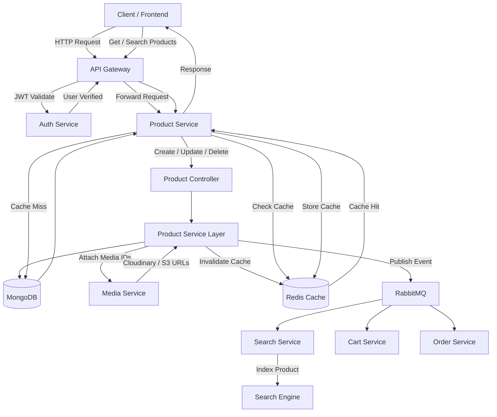

```mermaid
flowchart TD

    %% CLIENT
    A[Client / Frontend] -->|HTTP Request| B[API Gateway]

    %% AUTH
    B -->|JWT Validate| C[Auth Service]
    C -->|User Verified| B

    %% PRODUCT SERVICE
    B -->|Forward Request| D[Product Service]

    %% CREATE PRODUCT
    D -->|Create / Update / Delete| E[Product Controller]
    E --> F[Product Service Layer]
    F --> G[(MongoDB)]

    %% MEDIA
    F -->|Attach Media IDs| H[Media Service]
    H -->|Cloudinary / S3 URLs| F

    %% CACHE
    F -->|Invalidate Cache| I[(Redis Cache)]

    %% EVENTS
    F -->|Publish Event| J[RabbitMQ]

    %% EVENT CONSUMERS
    J --> K[Search Service]
    J --> L[Cart Service]
    J --> M[Order Service]

    %% SEARCH
    K -->|Index Product| N[Search Engine]

    %% READ FLOW
    A -->|Get / Search Products| B
    B --> D
    D -->|Check Cache| I
    I -->|Cache Hit| D
    D -->|Cache Miss| G
    G --> D
    D -->|Store Cache| I
    D -->|Response| A
```