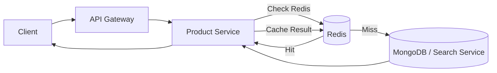

```mermaid
flowchart LR

    A[Client] --> B[API Gateway]
    B --> C[Product Service]

    C -->|Check Redis| D[(Redis)]
    D -->|Hit| C
    D -->|Miss| E[(MongoDB / Search Service)]

    E --> C
    C -->|Cache Result| D
    C --> A
```