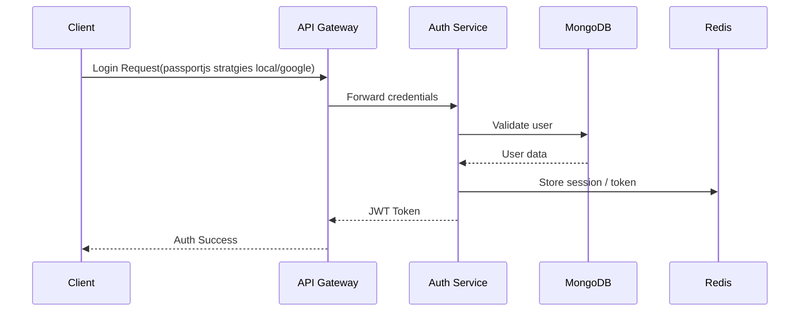

```mermaid
sequenceDiagram
    participant Client
    participant API as API Gateway
    participant Auth as Auth Service
    participant DB as MongoDB
    participant Cache as Redis

    Client->>API: Login Request(passportjs stratgies local/google)
    API->>Auth: Forward credentials
    Auth->>DB: Validate user
    DB-->>Auth: User data
    Auth->>Cache: Store session / token
    Auth-->>API: JWT Token
    API-->>Client: Auth Success

```