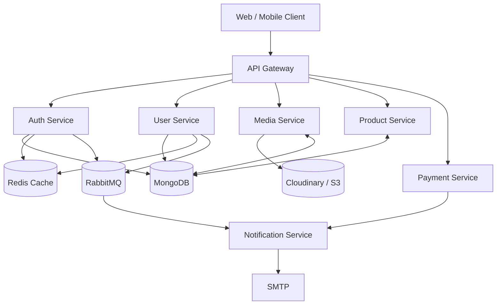

```mermaid
graph TD

    Client[Web / Mobile Client]

    APIGW[API Gateway]

    AuthService[Auth Service]
    UserService[User Service]
    MediaService[Media Service]
    NotificationService[Notification Service]
    ProductService[Product Service]
    PaymentService[Payment Service]

    MongoDB[(MongoDB)]
    Redis[(Redis Cache)]
    RabbitMQ[(RabbitMQ)]
    CloudStorage[(Cloudinary / S3)]

    Client --> APIGW

    APIGW --> AuthService
    APIGW --> UserService
    APIGW --> MediaService
    APIGW -->ProductService
    APIGW -->PaymentService

    AuthService --> MongoDB
    AuthService --> Redis

    UserService --> MongoDB
    UserService --> Redis

    MediaService --> CloudStorage
    MediaService <--> MongoDB

    AuthService --> RabbitMQ
    UserService --> RabbitMQ

    ProductService<-->MongoDB
    PaymentService -->NotificationService
    NotificationService-->SMTP
    RabbitMQ --> NotificationService

```